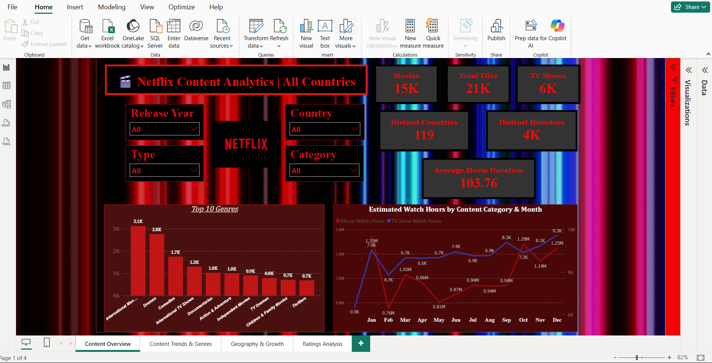
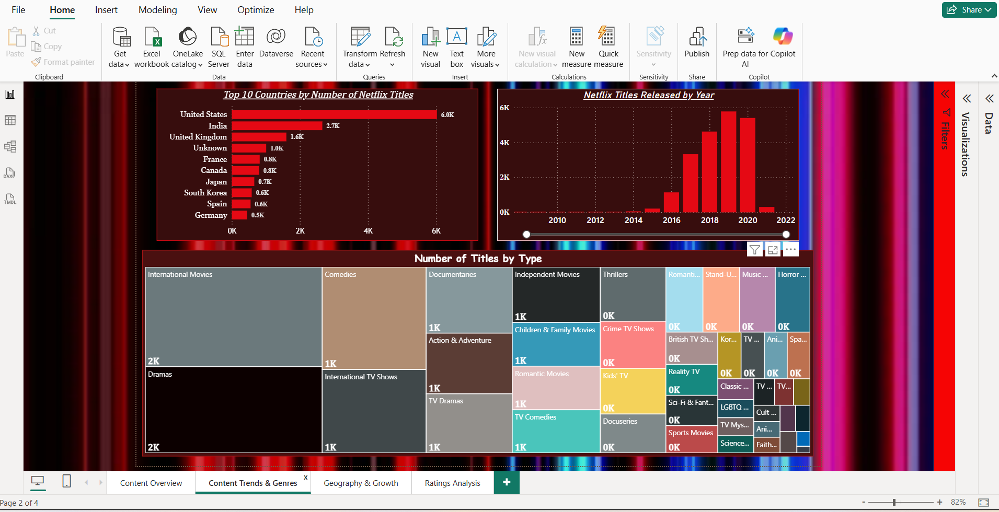
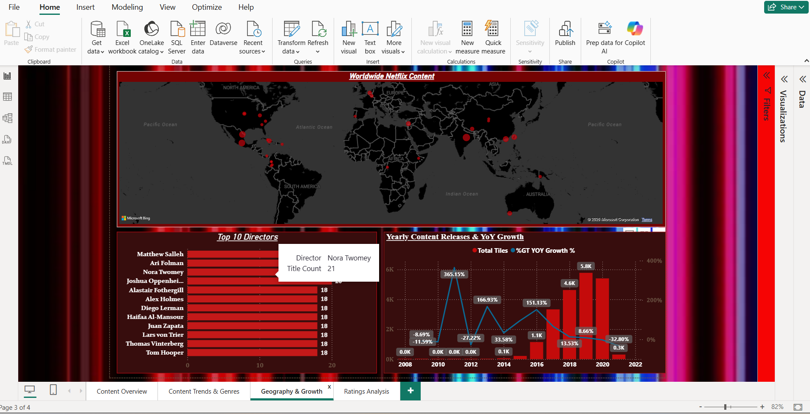
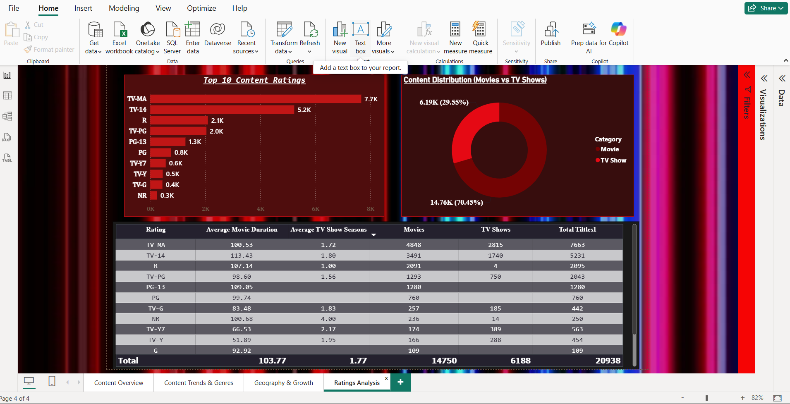

# Netflix Content Analysis Dashboard | Power BI

## Project Overview

This project presents an interactive analysis of Netflix content using Power BI. The dashboard explores content distribution, genres, ratings, countries, directors, release trends, and estimated watch hours.

The project demonstrates practical skills in data cleaning, transformation, DAX calculations, dashboard design, filtering, and data visualization.

## Dashboard Preview

### 1. Content Overview



### 2. Content Trends and Genres



### 3. Geography and Growth



### 4. Ratings Analysis



## Key Performance Indicators

- Total Titles: 20,938
- Movies: 14,750
- TV Shows: 6,188
- Distinct Countries: 119
- Distinct Directors: Approximately 4,000
- Average Movie Duration: 103.77 minutes
- Average TV Show Seasons: 1.77

## Dashboard Pages

### Content Overview

Provides a high-level summary of Netflix content, including:

- Total movies and TV shows
- Total titles
- Distinct countries and directors
- Average movie duration
- Top 10 genres
- Estimated watch hours by month and content category
- Interactive slicers for release year, country, type, and category

### Content Trends and Genres

Analyzes:

- Top 10 countries by number of titles
- Netflix titles released by year
- Distribution of titles across different genres
- Content growth and release patterns

### Geography and Growth

Presents:

- Worldwide distribution of Netflix content
- Top 10 directors
- Yearly content releases
- Year-over-year content growth

### Ratings Analysis

Examines:

- Top 10 content ratings
- Distribution of movies and TV shows
- Average movie duration by rating
- Average TV show seasons by rating
- Total titles by rating category

## Tools and Technologies

- Power BI Desktop
- Power Query
- DAX
- Data Modeling
- Data Visualization
- CSV Dataset

## Data Preparation

The dataset was prepared in Power Query by:

- Checking and handling missing values
- Correcting data types
- Standardizing text and category values
- Separating movie duration and TV show seasons
- Creating fields required for analysis
- Validating the cleaned data before visualization

## DAX and Calculations

DAX measures and calculated fields were created for:

- Total titles
- Total movies
- Total TV shows
- Distinct countries
- Distinct directors
- Average movie duration
- Average TV show seasons
- Previous-year titles
- Year-over-year growth percentage
- Estimated watch hours

## Key Insights

- Movies account for approximately 70% of the available content, while TV shows represent approximately 30%.
- The United States has the largest number of Netflix titles in the dataset.
- International Movies, Dramas, and Comedies are among the most common genres.
- TV-MA and TV-14 are the most frequently occurring content ratings.
- Netflix content releases increased strongly in the years leading up to 2020.
- The average movie duration is approximately 104 minutes.

## Repository Structure

```text
Netflix-Content-Analysis-PowerBI/
├── Dataset/
│   └── netflix_titles.csv
├── PowerBI/
│   └── Netflix_Content_Analysis_Dashboard.pbix
├── Screenshots/
│   ├── 01_Content_Overview.png
│   ├── 02_Content_Trends_and_Genres.png
│   ├── 03_Geography_and_Growth.png
│   └── 04_Ratings_Analysis.png
└── README.md
```

## How to Use

1. Download the `.pbix` file from the `PowerBI` folder.
2. Open it using Power BI Desktop.
3. Use the slicers and filters to explore the dashboard interactively.

## Author

**Nita Kumari**

Business Operations Professional with 5+ years of experience in operational reporting, KPI monitoring, and data handling, currently transitioning into Data Analytics with skills in Power BI, SQL, and Excel.
